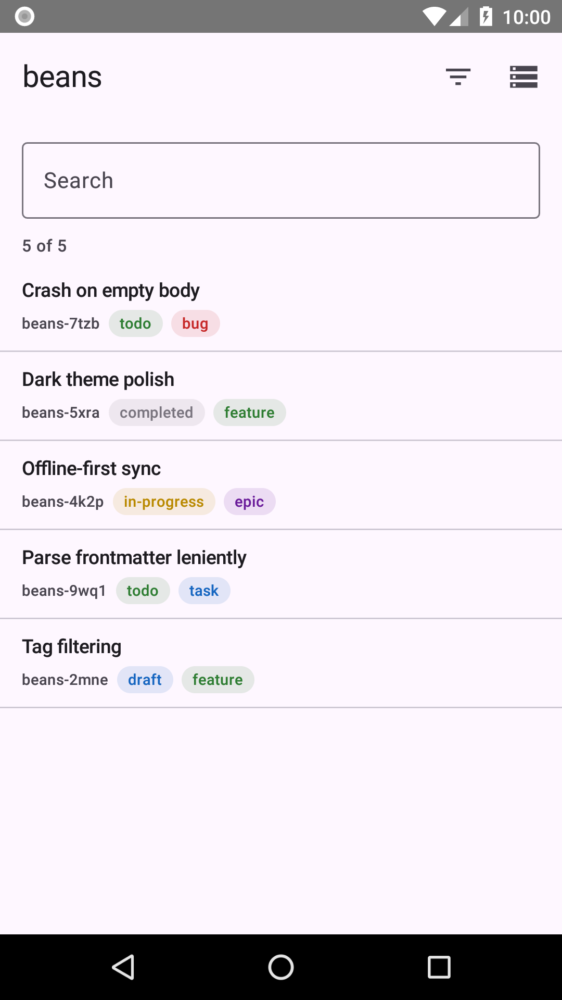

# Beans on Droid

An **unofficial** Android app for reading issues ("beans") from
[hmans/beans](https://github.com/hmans/beans), the flat-file issue tracker that
keeps issues as Markdown files with YAML frontmatter inside your git repository.

Not affiliated with, endorsed by, or supported by the beans project.

Phase 1, the current scope, is read-only: it clones a repository over HTTPS and
lets you browse, filter, search and read. Phase 2 adds editing, committing and
pushing.



## What it does

- Add one or more repositories by their HTTPS clone URL, with an optional
  personal access token for private ones.
- Shallow clone (depth 1) into storage private to the app.
- Pull to refresh, which fetches and hard-resets to the remote branch. The app
  never writes to your repository, so it never has to merge.
- A list of every bean with its id, title, status and type, filtered by status,
  type and tag, and searched across title, body and id.
- A detail view with the frontmatter, the body rendered as Markdown, and tappable
  links to parent, children, blocking and blocked-by beans.
- Filters are built from the statuses, types and tags your repository actually
  uses, not from a fixed list.

It is host-agnostic: it speaks plain git over HTTP, with no GitHub API, so
GitHub, GitLab, Gitea, Forgejo and a repository on your own server all work the
same way.

## Adding a repository

1. Open the repository screen from the icon in the top bar.
2. Tap the add button.
3. Paste the **HTTPS clone URL**, for example
   `https://github.com/hmans/beans.git`. SSH URLs are not supported in Phase 1.
4. For a private repository, paste a **personal access token** with read access
   to the repository. The token is sent as the HTTP basic username, which is what
   GitHub, GitLab and Gitea all accept.
5. Tap Add. The first clone can take a moment.

Tokens are encrypted with an AES-256 key generated in the Android Keystore and
stored as ciphertext. The key never leaves the keystore, and the plaintext token
is never written to disk or to a log. Removing a repository deletes its local
copy and its token together.

## Building

With nix:

```bash
nix develop
./gradlew assembleDebug
```

Without nix you need JDK 17, the Android SDK with platform 37 and build-tools
37.0.0, and `ANDROID_HOME` pointing at the SDK. Then:

```bash
./gradlew assembleDebug
```

The debug APK lands in `app/build/outputs/apk/debug/app-debug.apk` and can be
installed with `adb install -r app/build/outputs/apk/debug/app-debug.apk`.

### Checks

```bash
./scripts/gate.sh          # nix flake check, then build, unit tests, lint, coverage
./scripts/e2e.sh           # boots a headless API 26 emulator and runs the instrumented tests
./scripts/screenshots.sh   # regenerates the F-Droid screenshots from a real run
```

The coverage gate requires 70 percent overall and 80 percent on the parser and
index packages. `scripts/ship-change.sh` runs the gate and refuses to archive or
commit a change that fails it.

## Notes for anyone touching the git layer

**JGit is pinned to 6.4.0 and the version matters.** Newer JGit compiles,
installs and then dies on the first git operation at minSdk 26:

```
java.lang.NoSuchMethodError: No virtual method readNBytes(I)[B
  at org.eclipse.jgit.util.IO.readFully(IO.java:90)
```

`InputStream.readNBytes` arrived in Java 9 and on Android only in API 33, and it
sits on the path that reads a repository's `.git/config`, so every operation hits
it. Core library desugaring does not help: D8 can backport static methods and
desugar `java.nio.file`, but it cannot add an instance method to the platform's
`java.io.InputStream`. Switching `desugar_jdk_libs` for `desugar_jdk_libs_nio`
changed nothing.

Going backwards does not work either. JGit 5.13.x, the last release with a Java 8
baseline, has no `setDepth` on `CloneCommand` or `FetchCommand`, so it cannot do
the shallow clone this app relies on.

Scanning the 6.x line for the newest release that has shallow clone and does not
call `readNBytes`:

| Version | `setDepth` | calls `readNBytes` |
|---------|------------|--------------------|
| 6.3.0   | yes        | no                 |
| 6.4.0   | yes        | no                 |
| 6.5.0   | yes        | yes, 3 files       |
| 6.7.0   | yes        | yes, including `IO`|
| 6.10.1  | yes        | yes, including `IO`|

6.4.0 it is, verified by cloning, fetching and parsing on an API 26 emulator
rather than by reading release notes. `desugar_jdk_libs_nio` is kept because JGit
6.4.0 does use `Files.readString` and `Files.writeString`, which the nio variant
covers.

**If you bump JGit, run the instrumented tests on an API 26 emulator.** The unit
tests run on a desktop JVM and will pass regardless.

JGit also needs a `SystemReader` that does not look for `/etc/gitconfig` or a
writable home directory. `AndroidGit.install` supplies one, and the application
calls it at startup.

## How it is put together

Four layers, kept apart so Phase 2 only extends the lowest one:

| Layer | Responsibility |
|-------|----------------|
| `repo/RepoStore` | Clone, refresh, delete; the local working copy per repository |
| `bean/BeanParser` | A file to a `Bean`. The only code that knows the file format |
| `index/BeanIndex` | Filter, search and relationship queries over the parsed set |
| `data/BeansRepository` | The state the app is in, and the transitions between them |
| `viewmodel`, `ui` | Screens, which talk only to view models |

The format itself is documented in [docs/bean-format.md](docs/bean-format.md),
derived from the upstream Go source rather than guessed.

Further reading:

- [docs/BRIEFING.md](docs/BRIEFING.md) is the Phase 1 specification
- [docs/performance.md](docs/performance.md) has measured numbers at 600 beans
- [docs/fdroid.md](docs/fdroid.md) is the dependency and licensing audit
- `openspec/changes/archive/` holds the reasoning behind each change
- `.beans/` tracks this project's own milestones and epics, in beans

## Roadmap

**Phase 1, current.** Read-only browsing, filtering, search and detail view.

**Phase 2.** Editing. Change a bean's status, edit its body, create a bean, then
commit and push back to the remote. The layering exists for this: `RepoStore`
grows write, commit and push; `BeanParser` grows a renderer; nothing above the
data layer has to learn the file format.

Also on the list, in no particular order: SSH authentication, a board view
grouped by status, offline queueing of edits made without a connection, and
honouring `.beans.yml`'s custom statuses and types for filter ordering.

**Not planned.** Any use of the GitHub API, background sync, notifications, or
telemetry of any kind.

## Contributing

The build is gated: `./scripts/gate.sh` has to pass before anything is archived
or committed, and it enforces the coverage floor. Changes are planned as OpenSpec
proposals under `openspec/changes/` and tracked as beans in `.beans/`.

There are no comments in the code. If something needs explaining, it is explained
in the change's `design.md`, which is where the reasoning lives permanently.

## License

Apache-2.0. See [LICENSE](LICENSE).

Bean fixtures under `app/src/test/resources/fixtures/real/` are copied from
[hmans/beans](https://github.com/hmans/beans), which is also Apache-2.0.
